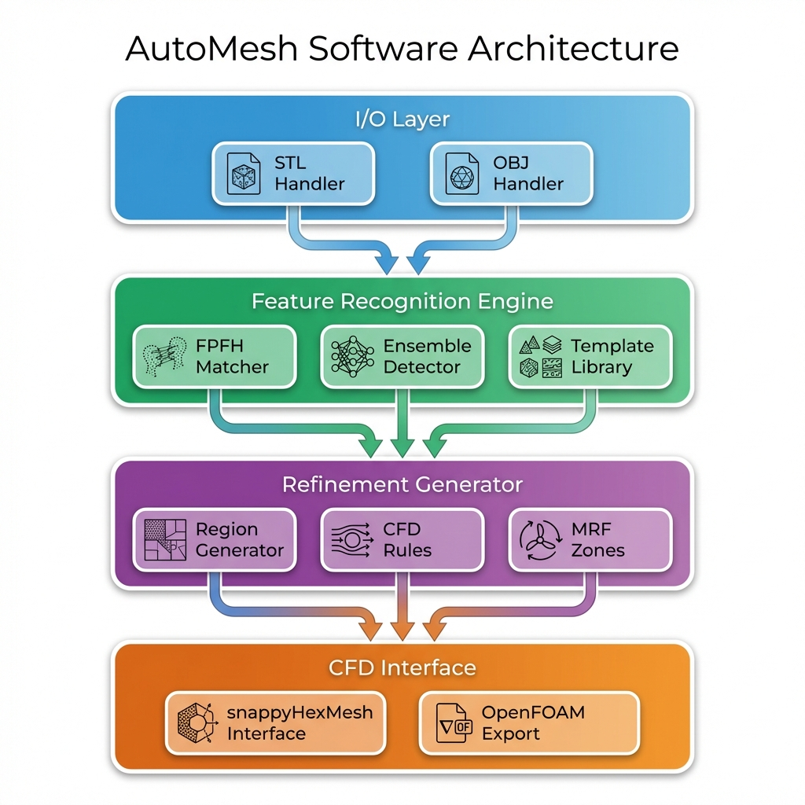

# AutoMesh

[](LICENSE)
[](https://www.python.org/downloads/)
[](https://karthikt.github.io/AutoMesh)

**Automatic CFD Mesh Refinement for OpenFOAM**


AutoMesh automatically generates optimized CFD mesh configurations from CAD geometry, bridging the gap between STL/OBJ files and production-ready OpenFOAM snappyHexMesh setups.

## ✨ Features

- 🎯 **Automatic Feature Detection** - Identifies geometric features using FPFH descriptors and template matching
- ⚡ **Fast Processing** - Generates mesh configurations in seconds
- 🔄 **MRF Support** - Automatic Moving Reference Frame zones for rotating components
- 📦 **Zero Training** - Works immediately without ML model training
- 🔧 **Extensible** - Plugin architecture for custom feature detectors
- 🐍 **Python SDK** - Complete programmatic API for automation workflows

## 🚀 Quick Start

### Installation

**Download Binary (Recommended):**

```bash
# macOS (Apple Silicon)
wget https://github.com/fedres/AutoMesh-Public/releases/latest/download/automesh-1.0.0-macos-arm64.tar.gz
tar -xzf automesh-1.0.0-macos-arm64.tar.gz
./automesh-1.0.0-macos-arm64/automesh --version
```

**Or Install from Source:**

```bash
git clone https://github.com/fedres/AutoMesh-Public.git
cd AutoMesh
pip install -e .
automesh --version
```

### Basic Usage

```bash
# Generate snappyHexMeshDict from STL
automesh -i model.stl -o snappyHexMeshDict

# With template-based feature detection
automesh -i car.stl -t wheel.stl mirror.stl -o output/

# Enable MRF zones for rotating features
automesh -i turbine.stl -t blade.stl --mrf --omega 314 -o case/
```

### Python SDK

```python
from meshmind.sdk.mesher import AutoMesher

mesher = AutoMesher()
mesher.load_target("model.stl")
mesher.detect_features(["wheel.stl"])
mesher.generate_refinement(enable_mrf=True)
mesher.export_snappy_dict("output/")
```

## 📖 Documentation

- **[Full Documentation](https://karthikt.github.io/AutoMesh)** - Complete guides and API reference
- **[Benchmarks](docs/benchmarks.md)** - Performance validation and example results
- **[Installation Guide](docs/getting-started/installation.md)** - Detailed setup instructions
- **[Roadmap](docs/roadmap.md)** - Future features and development plans

## 🏗️ How It Works


AutoMesh follows a simple pipeline:

1. **Load Geometry** - Parse STL/OBJ files
2. **Feature Detection** - Identify features using FPFH descriptors
3. **Refinement Generation** - Create CFD-optimized refinement volumes
4. **Export** - Generate snappyHexMeshDict and MRF files

## 🏛️ Architecture



Built with a modular design:
- **I/O Layer** - STL/OBJ file handling
- **Feature Recognition Engine** - FPFH matching and ensemble detection
- **Refinement Generator** - CFD rules and MRF zone creation
- **CFD Interface** - OpenFOAM export

## 💡 Use Cases

### Automotive CFD
Automatically detect and refine wheels, mirrors, and aerodynamic features for vehicle simulations.

### Aerospace Analysis
Generate refined meshes for wings, control surfaces, and engine components with wake regions.

### Rotating Machinery
Create MRF zones for fans, turbines, and propellers with single-command automation.

## 🤝 Contributing

Contributions are welcome! Please see [CONTRIBUTING.md](CONTRIBUTING.md) for guidelines.

## 📄 License

This project is licensed under the MIT License - see the [LICENSE](LICENSE) file for details.

## 🔗 Links

- [Documentation](https://karthikt.github.io/AutoMesh)
- [Issue Tracker](https://github.com/karthikt/AutoMesh/issues)
- [Releases](https://github.com/karthikt/AutoMesh/releases)

## 🙏 Acknowledgments

Built for the CFD community with modern computational geometry techniques.

---

<div align="center">
  <sub>Built with ❤️ for automated CFD workflows</sub>
</div>
