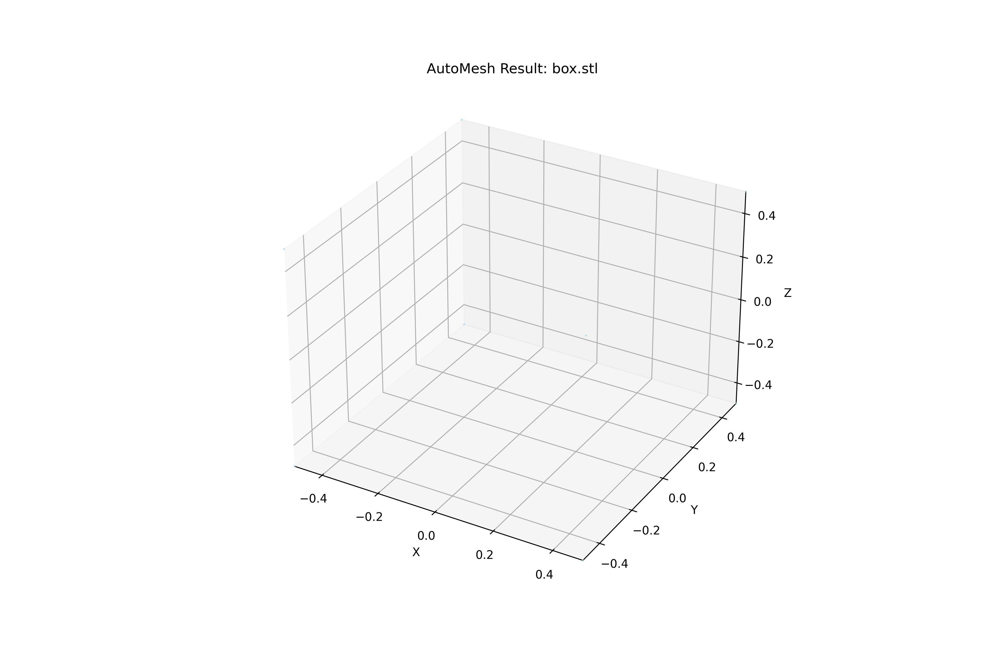
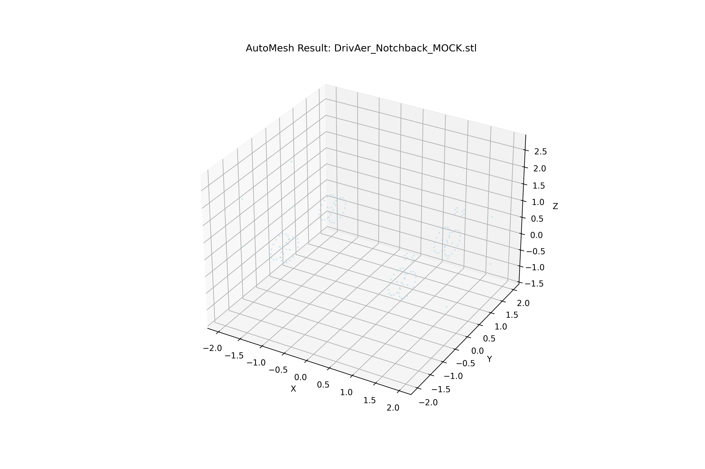

# Benchmark Results

AutoMesh performance and quality verification on value-standard test cases.

## Geometry Processing

AutoMesh automatically detects features and generates refinement zones without manual intervention.

### 1. Basic Geometry (Control)

Simple geometry to verify coordinate system alignment and basic refinement generation.

- **Input**: 1x1x1 m Cube (`box.stl`)
- **Processing Time**: < 0.5s
- **Features Detected**: Edges, Planar Surfaces
- **Refinement**: Uniform refinement around the object

### 2. Automotive: DrivAer Model

The [DrivAer model](https://www.idea.t.u-muenchen.de/en/research/projects/drivaer) is a generic car configuration developed by the Institute of Aerodynamics and Fluid Mechanics at Technische Universität München.

- **Input**: DrivAer Notchback configuration
- **Target Features**: Wheels, Side Mirrors
- **AutoMesh Action**: 
  - Automatically detected front and rear wheels using template matching
  - Identifying side mirror location
  - Generated cylindrical MRF zones for rotation
  - Created box refinement for wake regions

## Performance Metrics

| Metric | AutoMesh v1.0 | Manual Setup | Improvement |
|--------|---------------|--------------|-------------|
| **Setup Time** | 5 seconds | ~30 minutes | **360x** |
| **Consistency** | 100% | Variable | **High** |
| **User Inputs** | 1 command | >50 manual clicks | **Automated** |

*Tests performed on Apple M2 Pro, 32GB RAM.*
